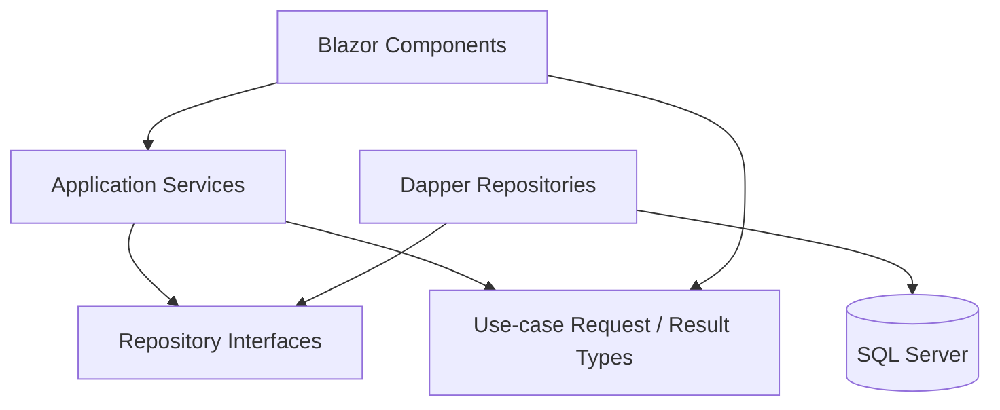

# アプリケーション方式・構成

最終更新日: 2026-09-27

## 1. 目的と前提

本アプリケーションは、競馬の過去データを収集・保存・分析し、将来のレース予想にも利用する。まずは個人がローカルPCで使うアプリケーションとして構築し、必要になった段階で利用端末を広げる。

- 利用者は当面、自分一人とする。
- 当面の利用端末はWindows PCとする。
- アプリケーションとSQL ServerはローカルPC上で運用し、外部ネットワークへ公開しない。
- アプリケーション側のロジックはC#で実装する。
- 将来、スマートフォンのブラウザーから利用できる可能性を残す。
- DBは既存のSQL Serverコンテナを使用し、Azure SQL Databaseとの互換性を意識する。

## 2. 決定事項

| 項目 | 決定 |
|---|---|
| .NET | .NET 10 LTS / ASP.NET Core 10 |
| アプリケーション方式 | ASP.NET Core上の単一Webアプリケーション |
| UI | Blazor Web App（Interactive Server） |
| アプリケーションロジック | C# |
| DBアクセス | Dapper + Microsoft.Data.SqlClient |
| テスト | xUnit。DB接続を伴うテストはローカルSQL Serverで実施 |
| 当面の起動・アクセス | Windows上でアプリを起動し、同じPCのブラウザーから `localhost` で利用 |
| ネットワーク公開 | 当面はloopback限定。LANやインターネットへ公開しない |
| DB | ローカルのDocker上で稼働するSQL Server |
| DB接続ユーザー | `sa`ではなく、アプリケーション専用ユーザー |
| DBスキーマ管理 | 既存の`database/ddl/`配下のSQLを正本とし、ORMマイグレーションは使わない |
| 将来のスマートフォン利用 | レスポンシブなWeb UIを利用。LAN公開前に認証・HTTPS・ファイアウォールを設計 |

## 3. 選定理由

### ASP.NET Core + Blazor Interactive Server

- UIとアプリケーションロジックをC#に統一できる。
- Webアプリなので、Windows PCではブラウザーから利用でき、将来はスマートフォンのブラウザーにも同じUIを提供できる。
- Interactive Serverなら当面クライアント側ランタイムや別のWeb APIを用意せず、単一プロセスで構成できる。
- WPFは当面のWindows利用には適するが、スマートフォン対応時にUIを作り直すことになる。MAUIやBlazor WebAssemblyは、現時点の単一利用者・ローカル運用には配布・構成の負担が先行するため採用しない。
- Interactive Serverはサーバーとの接続を維持する方式である。ローカルPCでの単独利用では問題になりにくいが、LAN公開時は接続数、認証、通信保護を改めて設計する。

### .NET 10 LTS

- 2026-09-27時点で.NET 10はサポート中のLTSであり、サポート終了予定日は2028-11-14。
- .NET 8/9はこの環境に導入済みだが、サポート終了が近いため新規開発の基準にはしない。.NET 10 SDKを別途導入する。
- .NET 10の最新サービシング更新を継続して適用する。

### Dapper + Microsoft.Data.SqlClient

- DBスキーマはアプリではなく、既存のDDLと設計資料が所有する。Dapperはスキーママイグレーションを持たず、この責務分担に合う。
- SQLを明示できるため、競馬データの検索・集計や既存Viewの利用で実行内容を把握しやすい。
- EF Coreの変更追跡やマイグレーション機能は現段階では必要性が低く、導入・運用する機能を増やさない。
- SQL Serverと将来のAzure SQL DatabaseにはMicrosoft.Data.SqlClientを使う。
- SQLは必ずパラメーター化し、文字列連結で利用者入力をSQLに埋め込まない。

### xUnit

- .NETの標準的なテスト基盤でアプリケーションサービスの単体テストを行う。
- SQLの実行やマッピングを確認する統合テストは、既存のローカルSQL Serverを使う。単体テストと統合テストを分け、通常のUI・サービス検証がDB起動に依存しないようにする。

## 4. 構成方針

- Blazorの画面コンポーネントにDBアクセスや業務ルールを直接持たせず、アプリケーションサービスとデータアクセス処理へ分離する。
- 39テーブルすべてを最初から抽象化せず、実装する機能が必要とする読み書きから追加する。
- 接続文字列やパスワードなどの秘密情報をソース管理しない。開発時は.NET User Secrets、実行時は環境変数を使う。Docker用`.env`は.NETから自動では読み込まない。
- アプリケーションの待受先はloopbackに限定し、LANやインターネットへ公開しない。
- アプリケーションのDB接続には既存のアプリ専用ユーザーを使い、必要最小限の権限を付与する。
- DBスキーマ定義・初期化は既存の`database/`配下のSQLとスクリプトを正本とし、アプリの都合だけで設計資料と異なるスキーマを作らない。

## 5. 初期クラス設計

最初のレース・馬・出走馬の登録と検索を対象とする。Blazorホストは1つのWebプロジェクトに置き、テストプロジェクトを分ける。機能や重複が実際に増えた場合に限り、追加のプロジェクトや抽象化を検討する。

### 5.1 依存方向



- Blazorコンポーネントはアプリケーションサービスだけを呼び出す。
- アプリケーションサービスはユースケース、入力検証、複数リポジトリをまたぐ処理を担当する。
- リポジトリのインターフェースはApplication側、SQL ServerとDapperを使う実装はData側に置く。
- Data側だけがSQLとDapperに依存する。SQLはパラメーター化し、接続は処理ごとに開放する。

### 5.2 最初に作るクラス

| クラス | 責務 |
|---|---|
| `RaceService` | レースの検索・詳細取得・登録更新を調整する。 |
| `HorseService` | 馬の検索・詳細取得・登録更新を調整する。 |
| `RaceEntryService` | レースへの出走馬登録・更新・一覧取得を調整する。出走前状態と結果状態を別々に扱う。 |
| `IRaceRepository` / `RaceRepository` | レース用の取得・保存処理の契約とDapper実装。 |
| `IHorseRepository` / `HorseRepository` | 馬用の取得・保存処理の契約とDapper実装。 |
| `IRaceEntryRepository` / `RaceEntryRepository` | 出走馬用の取得・保存処理の契約とDapper実装。 |
| `SqlConnectionFactory` | 設定からSQL Server接続を作成する。接続文字列をクラスへ直書きしない。 |

画面から渡す検索条件・入力と、一覧・詳細の結果は用途別の型にする。初期候補は`RaceSearchCriteria`、`RaceListItem`、`RaceDetails`、`SaveRaceRequest`、`HorseSearchCriteria`、`HorseListItem`、`SaveHorseRequest`、`RaceEntryListItem`、`SaveRaceEntryRequest`。必要な機能を実装する段階で必要な型だけを追加し、DBテーブルの全カラムを持つ型を一律に作らない。

### 5.3 プロジェクト配置案

```text
src/HorseRacing.App/
├─ Components/Pages/           # Blazor画面
├─ Application/
│  ├─ Races/                   # RaceService、検索・入力・結果型、IRaceRepository
│  ├─ Horses/                  # HorseService、検索・入力・結果型、IHorseRepository
│  └─ RaceEntries/             # RaceEntryService、入出力型、IRaceEntryRepository
└─ Data/
   ├─ SqlConnectionFactory.cs
   ├─ Races/RaceRepository.cs
   ├─ Horses/HorseRepository.cs
   └─ RaceEntries/RaceEntryRepository.cs

tests/HorseRacing.Tests/
├─ Application/                # リポジトリを差し替えたサービス単体テスト
└─ Data/                       # ローカルSQL Serverを使う必要な統合テスト
```

汎用Repository、汎用CRUD基底クラス、独立したDomainプロジェクトは初期段階では作らない。検索条件や画面入力型とDBテーブルの形が異なるため、Dapperの問い合わせ結果は用途別の結果型へ投影する。業務上の不変条件が複雑になった時点で、必要なDomain型を追加する。

## 6. 実装前に必要な準備・残課題

### 準備

- 開発環境に.NET 10 SDK 10.0.401をユーザー領域へ導入済み。PowerShellユーザープロファイルで.NET 10を優先するPATH設定を確認済み。
- アプリ用DBユーザーの接続情報を開発用User Secretsに設定する。実際のパスワードはソースや設計資料に記録しない。

### 実装時に決定

- ログの出力先・保持期間と、画面に表示するエラーの粒度
- 初期機能ごとのDB権限と、統合テストの実行手順
- 配布方法。まずは開発者がローカルで起動する形とし、常駐化やインストーラーは必要性が出てから判断する。

## 7. 参考資料

- [.NET and .NET Core Support Policy](https://dotnet.microsoft.com/en-us/platform/support/policy/dotnet-core)（2026-09-27確認）

## 8. 関連資料

- [プロジェクト概要](../../README.md)
- [データベース設計資料](../database/README.md)
