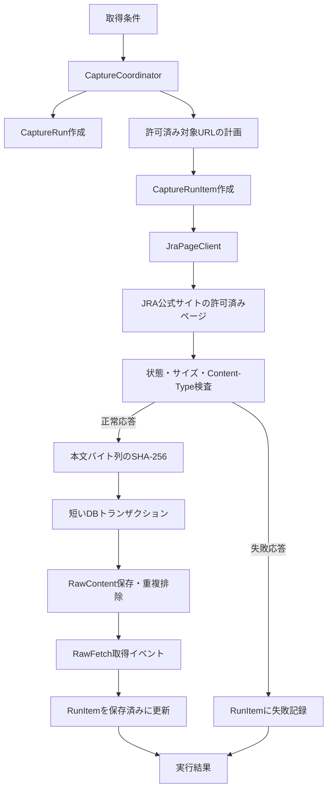

# データ収集アプリケーション設計案

最終更新日: 2026-09-27
状態: 第1段階（サイト取得・原本保存のみ）の設計案。JRAへの自動取得許可は未確認。

## 1. 目的と責務

この文書では、分析Webアプリとは別に、JRA公式サイトから許可されたページを取得して未加工の原本を保存する第1段階だけを設計する。

- 取得・保存処理: 対象ページの決定、HTTP取得、レスポンス検査、RawContent/RawFetch保存、実行結果の報告。
- 解析・登録処理: 保存済み原本の解析、内部IDへの対応付け、Race/Horse/RaceEntry等の登録。第1段階の対象外とし、後工程として設計する。
- 分析アプリ: 登録済みデータの検索、閲覧、分析。取得・保存処理とは独立させる。
- DDLとテーブル定義は引き続き`database/ddl/`と`docs/database/`を正本とする。アプリからスキーマを自動変更しない。

### 初期取得元

- 初期取得元は無料で閲覧できるJRA公式サイトとする。有料の第三者データ提供元は初期対象に含めない。
- DBの`DataSource`には、取得方式`WEB`、権威レベル`OFFICIAL`、有料フラグ`false`として登録する案とする。取得元名、優先順位、取得するページ・データ種別のコードは対象データを決めた後に確定する。
- 2026-09-27確認時点で、JRAの[`robots.txt`](https://www.jra.go.jp/robots.txt)は`User-agent: *`に対して`Disallow`が空。ただし、これだけでは自動取得の許可を意味しない。
- JRAの[「ご利用に際して」](https://www.jra.go.jp/use/)には著作権・二次利用の説明があり、映像・音声・画像・記事等はJRAまたは第三者の著作物とされる。自動取得、HTML原本保存、個人分析目的での再利用について、明確な包括許可や具体的なリクエスト間隔は確認できていない。
- 実装前にJRAへ取得対象、取得頻度、原本保存・再解析の可否を確認し、許可される方法だけを使う。自動取得が認められない場合は、許諾された配布方法へ切り替え、アクセス制限を回避しない。

第1段階は利用者が起動するC#のコンソールバッチを提案する。分析Webアプリ内の画面リクエストには処理をひも付けない。定期実行や専用の操作画面は、取得条件と運用上の必要性が固まってから検討する。

## 2. 処理フロー



1. 利用者が許可済みの対象種別・期間・ページ範囲を指定する。任意URLを直接入力させず、許可したJRAホスト・パスの範囲内で対象URLを生成する。
2. `CaptureRun`と対象URLごとの`CaptureRunItem`を短いDBトランザクションで作成する。URLは実装済みの許可リストと形式検証に通ったものだけ登録する。
3. `JraPageClient`がDBトランザクションを保持せず、一度に1リクエストずつ送信する。最低間隔はJRAから確認した条件を設定し、未確認の状態ではネットワーク取得を無効にする。
4. HTTP状態、最終URL、Content-Type、本文サイズを検査する。初期実装でRawContentに保存するのは、許可済みHTMLページに対するHTTP 200かつ空でない本文に限定する。
5. 本文を文字列化する前にバイト列のSHA-256を計算する。HTTPのContent-Encoding圧縮はHTTPクライアントで展開した後、文字コード変換前の本文バイト列をハッシュ・保存対象とする。
6. RawContentの重複確認/挿入、RawFetchの追加、CaptureRunItemの保存済み状態への更新を1つのDBトランザクションで確定する。
7. HTTP応答なし・不正状態・許可外リダイレクト・上限超過本文は、RawContent/RawFetchへ登録せず、CaptureRunItemに失敗理由を短いDBトランザクションで記録する。
8. 全Itemの終了後にCaptureRunの状態と終了時刻を更新し、要求・保存・重複内容・失敗件数を出力する。本文・Cookie・認証ヘッダーはログに出さない。

この段階では保存したHTMLを解析せず、`Race`/`Horse`/`RaceEntry`、SourceMapping、RaceRawFetchLink/RaceEntryRawFetchLinkも更新しない。保存済みRawFetchを入力として扱う解析・インポート処理は別の後工程にする。

## 3. 初期クラス・プロジェクト案

```text
src/HorseRacing.Collector/
├─ Program.cs
├─ Application/
│  ├─ CaptureRequest.cs
│  ├─ CaptureCoordinator.cs
│  ├─ CaptureResult.cs
│  └─ CaptureTarget.cs
├─ Sources/Jra/
│  ├─ JraRequestPlanner.cs
│  └─ JraPageClient.cs
└─ Data/
    ├─ SqlConnectionFactory.cs
    ├─ CaptureRunRepository.cs
    ├─ CaptureRunItemRepository.cs
    ├─ RawContentRepository.cs
    ├─ RawFetchRepository.cs
    └─ DataSourceRepository.cs
```

- `CaptureRequest`: 許可済みデータ種別と対象期間・IDを表す。任意URLは受け取らない。
- `CaptureTarget`: DataTypeCode、要求URL、外部ID（既知なら）を保持する。HTML本文を解析して外部IDを抽出する機能は持たない。
- `CaptureCoordinator`: Run/Item作成、URL列挙、逐次取得、失敗分類、Run状態集計を調整する。HTTP通信中はDBトランザクションを保持しない。
- `JraRequestPlanner`: 許可済みページ規則と利用者指定範囲からCaptureTargetを生成する。任意ホスト・任意パスへのURL生成は禁止する。
- `JraPageClient`: HttpClientでHTTP取得を行う。最低間隔、タイムアウト、キャンセル、HTTP状態、Content-Type、本文サイズ、同一許可ホストへのリダイレクトを扱い、HTML解析はしない。
- `CaptureRunRepository` / `CaptureRunItemRepository`: 実行と対象URLごとの状態、試行回数、直近エラーを管理する。
- `RawContentRepository` / `RawFetchRepository`: SHA-256重複排除、原本保存、取得イベント保存を担当する。
- `DataSourceRepository`: DataSource/DataTypeの設定済みコードを取得する。コード値自体はDB設計と合意に従い登録する。
- DapperとSQLはDataアクセス処理に閉じ込める。保存原本を使う解析・業務データ登録は別工程とし、後工程で共有が必要になった場合に共通ライブラリを検討する。

## 4. 原本保存と重複排除

既存の`RawContent`/`RawFetch`を使い、同じページ内容を重複保存せず、各取得イベントを残す。

- `RawContent.ContentHash`はデコード前のバイト列から求めたSHA-256を保存する。
- 原本が既に存在する場合は再利用するが、取得イベントごとに`RawFetch`を追加する。
- `RawFetch.RawContentId`は必須なので、原本本文を取得できた正常応答だけをRawFetchとして記録する。
- 原本がDB保存方式の場合、RawContentの有無確認/挿入とRawFetch挿入を同一トランザクションで確定する。ContentHashの一意制約を競合時の重複防止の最終保証とする。
- 同一原本を再取得した場合もRawFetchは新規追加する。内容の同一性と取得時点を別々に保持する。
- URLのリダイレクト先は許可済みホストの範囲内であることを検査する。

初期の原本保存方式は`DATABASE`を提案する。RawContentとRawFetchをDBトランザクション内で確定できるためである。実データ量を計測し、DBサイズやバックアップ時間が問題になった場合に`COMPRESSED_FILE`へ移行する。外部ファイル方式ではDBとファイルの間に分散トランザクションがないため、一時ファイルへの書込み、DB確定後の確定名変更、孤立ファイル検出による復旧を設計する。

### 4.1 RawContent/RawFetch保存アルゴリズム

1. レスポンス本文はストリームとして読み、設定された最大バイト数を超えた時点で中断する。最大値はJRAから許可された対象ページを確認した後に決め、無制限読み込みはしない。
2. HTTPクライアントがContent-Encodingを展開した本文バイト列についてSHA-256を計算し、64文字の小文字16進文字列へ正規化する。
3. SQL Server接続を開き、短いトランザクションを開始する。HTTP待機中にはトランザクションを開かない。
4. `ContentHash`が存在する場合はそのRawContentIdを再利用する。なければStorageTypeCode=`DATABASE`、RawBinary、ContentLength、ContentHash、ContentEncodingを挿入する。
5. `RawFetch`を取得イベントごとに追加する。SourceUrlは許可済みホストの最終URL、ExternalIdは要求条件で事前に分かる場合のみ設定し、RetrievedAtはUTC、HttpStatusCodeは最終レスポンス状態を保存する。
6. CaptureRunItemにRawFetchId、HttpStatusCode、保存済み状態を設定して同じトランザクションで確定する。
7. ContentHash一意制約に競合した場合は挿入トランザクションをロールバックし、既存RawContentIdを再取得してからRawFetch/Item保存を再実行する。ContentHash一意制約を無効化・削除しない。

`ContentEncoding`にはContent-Typeに明記された文字コード名を記録する。文字コードの自動判定結果だけを確定値として保存せず、ヘッダーにない場合はNULLとし、後工程の解析器がHTML内の宣言などを使って判定する。HTTPレスポンス本文はこの工程で文字列化・整形・HTML正規化しない。

## 5. 取得失敗・再実行

現行`RawFetch`は必須の`RawContentId`を持つため、DNS/接続/タイムアウトなど本文のない失敗や空本文のHTTP応答を登録できない。第1段階ではこれらをコンソールの構造化ログと終了結果に記録し、RawFetchは作らない。

第1段階からRun/Item状態をDBへ残し、プロセス中断後に未完了Itemを再開できるようにするため、次の2テーブルを既存DB設計へ追加する案を推奨する。

- `CaptureRun`: 以下の論理カラムを持つ。実行件数はItemから集計し、二重更新するカウンターは初期版では持たない。

| カラム | 型・制約案 | 用途 |
|---|---|---|
| CaptureRunId | BIGINT IDENTITY、PK | 収集実行ID |
| DataSourceId | INT、NOT NULL、FK | JRAのDataSource |
| DataTypeCode | VARCHAR(30)、NOT NULL、FK | 今回取得するデータ種別 |
| RunStatusCode | VARCHAR(24)、NOT NULL、CHECK | 実行状態 |
| StartedAt | DATETIME2、NOT NULL | 開始時刻（UTC） |
| CompletedAt | DATETIME2、NULL | 終了時刻（UTC） |
| CreatedAt / UpdatedAt | DATETIME2、NOT NULL | 作成・更新時刻（UTC） |

- `CaptureRunItem`: 取得予定URLごとに1行を持ち、試行回数と直近結果を記録する。

| カラム | 型・制約案 | 用途 |
|---|---|---|
| CaptureRunItemId | BIGINT IDENTITY、PK | 対象項目ID |
| CaptureRunId | BIGINT、NOT NULL、FK | 所属する実行 |
| ItemNumber | INT、NOT NULL | 実行内の順序 |
| RequestUrl | NVARCHAR(1000)、NOT NULL | Allowlist検証済み要求URL |
| ExternalId | NVARCHAR(200)、NULL | 要求条件で既知の場合のみ |
| ItemStatusCode | VARCHAR(20)、NOT NULL、CHECK | 対象項目の状態 |
| AttemptCount | SMALLINT、NOT NULL、DEFAULT 0 | HTTP試行回数 |
| LastAttemptAt | DATETIME2、NULL | 最終試行時刻（UTC） |
| LastHttpStatusCode | SMALLINT、NULL | 最終HTTP状態 |
| RawFetchId | BIGINT、NULL、FK | 成功時の取得イベント |
| LastErrorCode | VARCHAR(50)、NULL | 分類済みエラーコード |
| LastErrorMessage | NVARCHAR(1000)、NULL | 秘密情報を除いた短い説明 |
| CreatedAt / UpdatedAt | DATETIME2、NOT NULL | 作成・更新時刻（UTC） |

主キーはそれぞれのID列とし、`CaptureRunItem`には`UNIQUE (CaptureRunId, ItemNumber)`を設定する。再開検索用に`(CaptureRunId, ItemStatusCode, ItemNumber)`のIndexを設定する。RequestUrlの重複はRun作成前に除去する。URLが長く一意キーに適さないため、URL列自体には一意制約を付けない。

Run状態コード案: `RUNNING`、`COMPLETED`、`COMPLETED_WITH_ERRORS`、`FAILED`、`CANCELLED`。Item状態コード案: `PENDING`、`IN_PROGRESS`、`STORED`、`RETRY_WAIT`、`FAILED`、`SKIPPED`。固定状態コードはCHECK制約で管理する。

CaptureRun/Itemは現行スキーマには存在しない。採用する場合はテーブル定義、ER図、DDL、初期化・検証スクリプトを同じ変更で更新してから実装する。試行回ごとの完全な履歴は初期版では持たず、AttemptCountと直近の状態・エラーを保持する。監査上すべての試行履歴が必要になった場合はCaptureAttempt子テーブルを別途検討する。

- 初期版は同時実行を1プロセスに制限し、名前付きMutexで多重起動を防ぐ。開始時に古い`RUNNING` Runがあれば、プロセスがMutexを取得できたことを確認してから、中断した`IN_PROGRESS` Itemを`RETRY_WAIT`へ戻す。
- 再開時は`PENDING`/`RETRY_WAIT`だけを実行する。`STORED` Itemは自動で再取得しない。再取得が必要なら新しいCaptureRunを作成し、同一ContentHashはRawContentを共有しつつ新しいRawFetchを追加する。
- Run状態遷移は`RUNNING`から`COMPLETED`、`COMPLETED_WITH_ERRORS`、`FAILED`、`CANCELLED`のいずれかで終了する。Itemは`PENDING`から`IN_PROGRESS`を経て`STORED`/`RETRY_WAIT`/`FAILED`/`SKIPPED`へ遷移する。

## 6. HTTP取得規則

- 許可されたホストは初期段階では`www.jra.go.jp`を基準とする。JRAサイトの利用条件と対象ページを確認した後に限定パスをAllowlistへ登録し、別ホストは個別に許可されない限り取得しない。
- URLはPlannerが生成し、スキームはHTTPSに限定する。利用者入力をそのままURLにせず、ホスト名・ポート・パス接頭辞を送信直前にも再検査する。
- 自動リダイレクトは無効にし、Locationを1段ずつ検査する。リダイレクト先もHTTPSかつAllowlist内の場合だけ追従する。許可外への遷移はItem失敗として停止する。
- `User-Agent`はCollector名と連絡先の設定値を使用する。ブラウザーになりすまさない。連絡先はJRAの許可条件確認時に決める。
- 同時実行数は1。リクエスト間隔は許可条件で確認した最小間隔以上に設定し、コードへ固定値を書かない。
- 接続/応答タイムアウトと最大本文サイズを設定する。受信はストリーム処理し、サイズ上限を超えたら読み込みを中止してItemを失敗にする。
- 初期版の保存対象はHTTP 200、許可済みContent-Type（初期案`text/html`）、空でない本文に限定する。その他の2xx、3xx、4xx、5xxはRawFetchとして保存しない。
- 429または一時的な5xxではRetry-Afterを尊重し、許可された頻度を超えない有限回の再試行をする。401/403や許可外リダイレクトではそのItemを再試行せず、403が返った場合はRun全体を停止する。最大試行回数はJRAの条件確認時に決める。
- 取得しない対象としてrobots.txtのDisallowに合致するパスを除外する。現在確認したrobots.txtはDisallow空だが、利用許可確認の代替とはしない。

## 7. 安全な取得とテスト

- 公式API、配布データ、または利用許諾された取得元を優先する。利用規約、ライセンス、アクセス頻度の条件を確認する。
- 初期取得元のJRA公式サイトは無料閲覧可能な範囲を対象とするが、自動取得の許可は別途確認する。許可されたページ・方法・頻度だけを使用する。
- 取得間隔、タイムアウト、最大本文サイズ、有限の再試行回数を設定可能にする。429や一時的な5xxを無制限に再試行しない。
- 認証情報をログやDBへ出さず、アクセス制限・有料壁・CAPTCHA等を回避しない。
- 単体テストは合成または許諾済みfixtureを使い、URL範囲制限、応答検査、ハッシュ、重複排除、失敗分類、キャンセルを検証する。
- HTTPテストはHttpMessageHandler等を差し替え、通常のテストで実サイトへアクセスしない。
- 統合テストはローカルSQL Serverを使用し、同一原本の重複排除とRawFetchが取得ごとに追加されることを検証する。通常のテストではJRAへアクセスしない。
- HTML解析、業務データ登録、外部ID照合、Race/RaceEntryリネージは後工程のテスト対象であり、第1段階には含めない。

## 8. 実装開始前に決めること

1. JRA公式サイトで取得するページ・データ種別と取得期間・件数。URL列挙は利用者入力の対象ID・期間と、許可確認済みのページ規則から行い、保存段階でHTML内リンクを辿らない。
2. 対象ページ・方法で自動取得、原本保存、個人分析目的の再利用が許可されるか。公開ページ上で明確でない条件はJRAへ問い合わせる。
3. JRAから確認した最低アクセス間隔、リクエスト数、同時接続数、対象ホスト・パス。
4. `DataSource` / `DataType`に登録する具体的なコード・名称とDataSourceの優先順位。
5. CaptureRun/CaptureRunItemのDDLを既存DBへ追加する。
6. 許可されたアクセス間隔、最大試行回数、最大レスポンスサイズ、User-Agent連絡先を確定する。

本設計の実装範囲はサイト取得と原本保存までである。JRAから自動取得条件が確認できるまではサイトへアクセスする実装を有効化しない。HTMLの解析・正規化・業務テーブル登録は後工程として別に設計する。